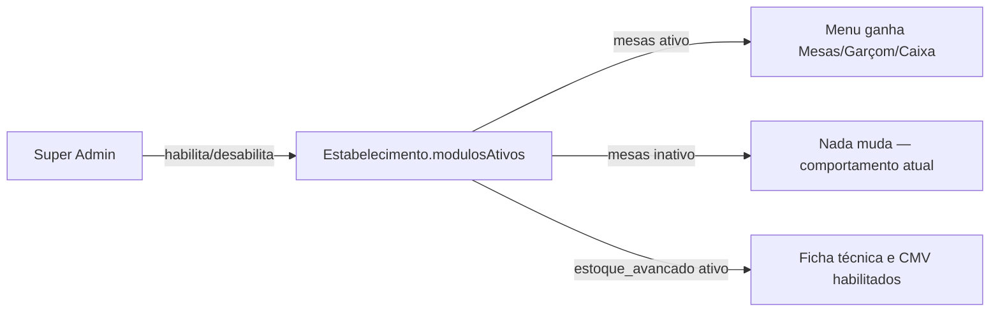
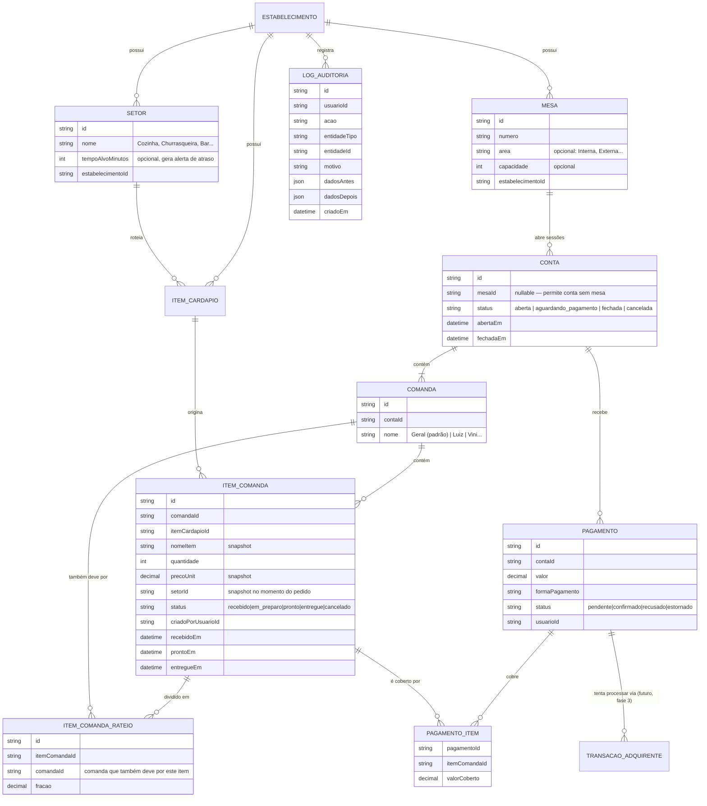
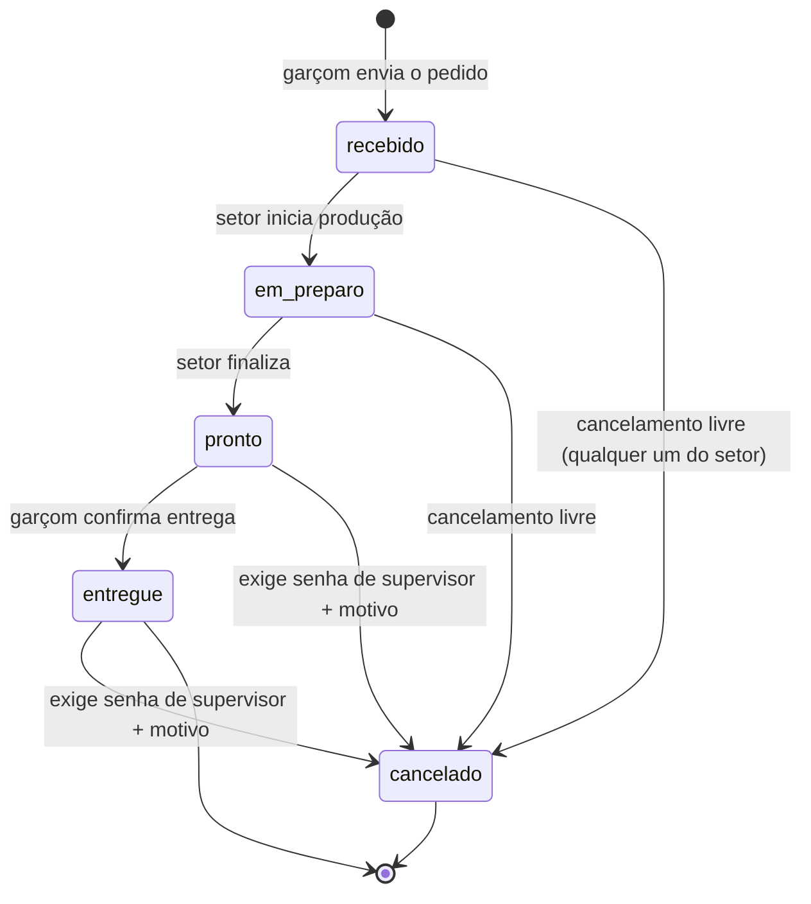
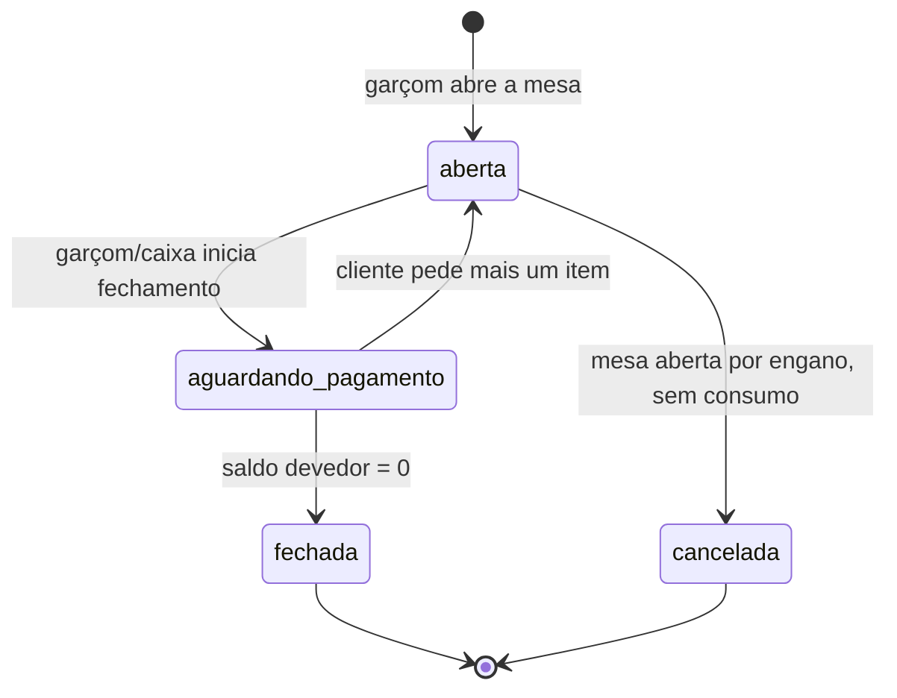
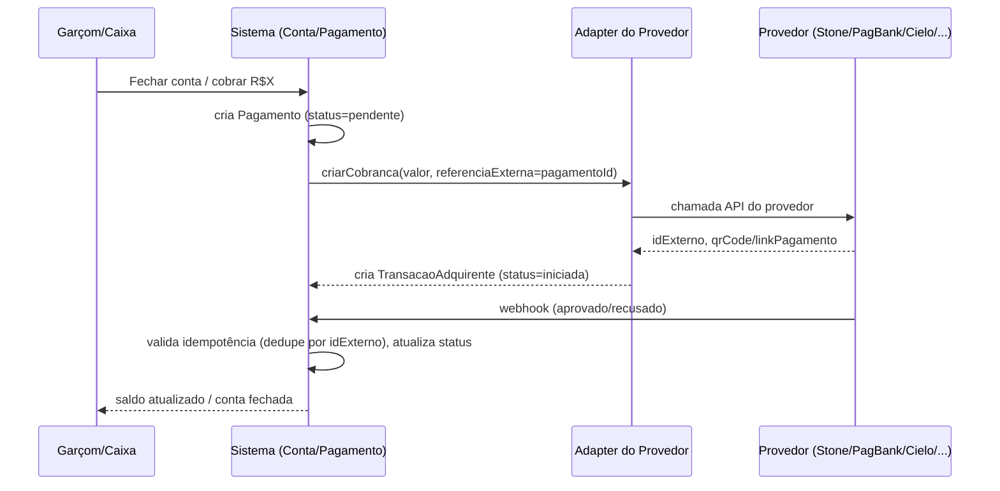

# Módulo de Mesas, Contas e Comandas — Design

Data: 2026-07-04
Status: aprovado para virar plano de implementação (Fase 1)

## Contexto

Hoje o cliente de referência (restaurante de rua, com área externa, cozinha e churrasqueira separada)
opera o salão inteiramente no papel: garçom anota o pedido, caminha até a cozinha, entrega o prato e,
no fechamento, **o próprio cliente informa o que consumiu** — sem conferência sistemática. Isso é
fonte direta de perda financeira, além de não deixar nenhum rastro de erro ou fraude.

O produto já resolve bem o fluxo **sem mesa** (balcão e delivery via link público, modelo `Pedido` em
`prisma/schema.prisma`). Este documento define como estender o produto pro fluxo **com mesa**, onde
um garçom lança pedidos pelo celular, cada setor de produção (cozinha, churrasqueira, bar...) só vê o
que é seu, e a conta pode ser dividida entre várias pessoas na mesma mesa — sem forçar nenhuma mudança
de comportamento nos clientes que só usam balcão/delivery (ex: a galeteria).

## Problemas identificados no fluxo atual

### Operacionais (perda de dinheiro, fraude, erro, retrabalho)

| # | Problema | Causa raiz | Como este design resolve |
|---|---|---|---|
| 1 | Fechamento sem conferência — cliente informa o que consumiu, funcionário acredita | Nenhum registro digital do que foi pedido por mesa | Comanda é a fonte única da verdade; ninguém "informa" nada, o sistema já sabe |
| 2 | Nenhuma rastreabilidade de quem alterou/cancelou/descontou | Papel não audita nada | `LogAuditoria` genérico + senha de supervisor para ações sensíveis |
| 3 | Papel se perde, rasga ou é mal interpretado | Intermediação manual entre garçom e cozinha | Pedido digital direto do celular do garçom pro setor certo |
| 4 | Cozinha recebe tudo junto, mesmo o que é da churrasqueira | Nenhuma separação por estação de produção | Setor de produção roteia automaticamente por item |
| 5 | Ninguém sabe se um pedido está atrasado até o cliente reclamar | Sem cronômetro nem alerta | Status por item + cronômetro visual por setor |
| 6 | Garçom esquece de levar um prato ou entrega na mesa errada | Tudo de memória | Fila visual por setor, com etiqueta de mesa/comanda |
| 7 | Divisão de conta manual, propensa a erro e a conflito entre clientes | Soma de cabeça no fechamento | Modelo de Comandas por pessoa, com item já atribuído |
| 8 | Processo não escala — funciona com 5 mesas, quebra com 50+ | Limite de memória humana | Sistema estruturado independe do número de mesas |

### UX por perfil

- **Garçom:** hoje escreve e caminha até a cozinha (tempo perdido, risco de esquecer). Precisa de uma
  interface rápida, com poucos toques, usável em pé e com luz de rua — um app lento faz o garçom voltar
  pro papel escondido, o que mataria a adoção.
- **Caixa:** hoje pergunta ao cliente o que ele consumiu. Precisa ver exatamente o que cada comanda
  deve, sem perguntar nada.
- **Cozinha/Churrasqueiro:** hoje recebe pedido de voz ou papel, no meio da correria. Precisa de uma
  fila organizada por setor, sem repetição verbal.
- **Gerente/Dono:** hoje não tem nenhuma visão em tempo real do salão. Precisa saber quantas mesas
  estão ocupadas, quais pedidos estão atrasados e quanto já faturou, sem sair do balcão.
- **Administrador da plataforma (Super Admin):** precisa ligar/desligar módulos por cliente sem tocar
  em código, porque nem todo estabelecimento vai pagar por todos os módulos.

### Problemas de futuro (escala e diversidade de negócio)

- Um modelo pensado só para "mesa numerada" quebra para food truck (sem mesa) ou self-service (paga
  por peso). Resolvido tornando `Mesa` opcional na `Conta` — o mesmo conceito de Conta/Comanda serve
  pra guichê, comanda avulsa ou item especial tipo "Buffet — 0.850kg".
- Com 300 mesas, a tela de produção pode receber um volume alto de itens simultâneos — o Socket.IO
  precisa transmitir por sala de **setor**, não broadcast geral, e a UI precisa paginar/filtrar bem.
  Isso é um requisito não funcional a levar para o plano de implementação, não uma mudança de modelo.
- Multi-unidade (já no roadmap do `CLAUDE.md`) exige que tudo continue isolado por `estabelecimentoId`
  — já é assim hoje, nenhuma mudança adicional necessária.

## Princípio arquitetural: módulos habilitáveis por estabelecimento

Este é o ponto de partida que muda tudo: **o módulo de mesas não pode forçar uma migração de
comportamento para quem não vai usá-lo** (ex: a galeteria, que é delivery/balcão). A solução adotada
segue o mesmo padrão que já existe em `Usuario.permissoes` (`String[]` validado em código contra uma
lista conhecida): `Estabelecimento.modulosAtivos: String[]`, validado contra uma lista `TODOS_MODULOS`
mantida em código.



Vantagens sobre as alternativas consideradas:

- **Descartada: unificar `Pedido` e `Conta` numa tabela só desde já.** Forçaria migração de dados e
  risco de regressão para todo cliente existente, mesmo quem nunca vai usar mesas. Sem ganho imediato
  que justifique o risco.
- **Descartada: construir Mesa/Conta/Comanda num sistema totalmente isolado, sem nenhum ponto de
  contato com o que existe.** Cria dois "cérebros" de pedido para sempre — cozinha, notificações e
  relatórios precisariam de lógica duplicada por origem, aumentando o custo de manutenção para sempre.
- **Escolhida: tabelas novas e aditivas, ligadas por um feed de produção compartilhado** (ver seção
  "Produção multi-setor"), com o módulo controlando apenas a **visibilidade** das telas novas. Zero
  risco para quem não usa; caminho aberto pra eventual unificação futura, sem compromisso agora.

Isso também é exatamente o modelo de monetização em camadas que o negócio precisa (“R$99,90 =
balcão+delivery, R$X = +mesas”), sem construir um sistema de planos/billing formal agora — isso fica
para quando (se) fizer sentido reaproveitar o mesmo pacote de módulos em massa.

## Modelagem de domínio



### Explicação de cada entidade nova

- **Mesa** — entidade cadastrada (não texto livre). Tem número, área opcional (Interna/Externa) e
  capacidade opcional. Cadastrada pelo DONO em Configurações, escolhida pelo garçom numa grade — nunca
  digitada. Isso viabiliza status visual (livre/ocupada/aguardando pagamento) e evita duas contas
  abertas por engano na mesma mesa física.
- **Setor** — recurso **base**, disponível pra qualquer estabelecimento (não travado no módulo pago de
  mesas), porque até quem só faz delivery pode ter cozinha e churrasqueira separadas. Todo
  estabelecimento nasce com 1 setor padrão ("Cozinha") — zero mudança pra quem não mexer em nada. Cada
  `ItemCardapio` aponta pra um Setor (default: o setor padrão).
- **Conta** — a sessão de consumo. Pode ter uma Mesa (fluxo de salão) ou não (reservado pra usos
  futuros, ex: comanda de balcão avulsa). Controla o ciclo de vida financeiro/operacional da visita:
  `aberta → aguardando_pagamento → fechada` (ou `cancelada`).
- **Comanda** — sub-conta dentro da Conta, dona dos itens. Toda Conta nasce com 1 Comanda "Geral"
  automaticamente — o garçom não precisa perguntar nome de ninguém a menos que peçam pra separar depois.
  Comandas podem ser criadas, renomeadas e itens podem ser transferidos entre elas a qualquer momento.
- **ItemComanda** — o item de fato pedido, com snapshot de nome/preço (mesmo padrão que `ItemPedido`
  já usa hoje) e um `setorId` também snapshotado (se o item mudar de setor no cardápio depois, pedidos
  antigos não mudam de rota retroativamente). Tem status **próprio**, independente do status da Conta.
- **ItemComandaRateio** — usado só quando um item é compartilhado entre comandas (ex: uma pizza entre
  3 pessoas). O item continua existindo uma única vez (a cozinha nunca sabe que foi dividido
  financeiramente); o rateio é só um registro de "quem mais deve por esse item".
- **Pagamento** — sempre existe, qualquer que seja a forma. Cobre um subconjunto específico de itens
  (via `PagamentoItem`), nunca "a comanda inteira" como conceito rígido — isso é o que permite
  pagamento parcial, pagamento de itens específicos e divisão sem precisar de um modo especial para
  cada caso (ver seção "Divisão de conta").
- **TransacaoAdquirente** — **não construída na Fase 1**, documentada aqui só pra garantir que
  `Pagamento` já nasce com a forma certa de encaixar isso depois (ver seção "Arquitetura de
  pagamento").
- **LogAuditoria** — tabela única, append-only, para qualquer ação sensível em qualquer entidade.
  Evita colunas do tipo `canceladoPorUsuarioId` espalhadas em cada tabela toda vez que uma ação nova
  precisar de rastro.

## Fluxo de status

Duas máquinas de estado independentes — **não confundir o relógio da comida com o relógio do
dinheiro**:



*Status por `ItemComanda` (`StatusProducao`) — enum novo, deliberadamente separado do `StatusPedido`
atual, que carrega semântica de entrega/pagamento que não existe no consumo em salão.*



*Status da `Conta`.*

### Quem pode fazer o quê (prevenção de fraude)

| Ação | Quem pode | Auditado? |
|---|---|---|
| Marcar item em preparo/pronto | Qualquer um com acesso a produção | Sim (timestamps bastam) |
| Cancelar item antes de pronto | Qualquer garçom/cozinha | Sim, sem exigir senha |
| Cancelar item pronto/entregue (= desperdício real) | Exige senha de supervisor | Sim, motivo obrigatório |
| Transferir item entre comandas | Garçom/caixa | Sim |
| Dar desconto | Permissão `caixa` + senha de supervisor acima de X% (configurável) | Sim, valor e motivo |
| Estornar pagamento | Permissão `caixa` + senha de supervisor | Sim — nunca apaga o pagamento original, cria um registro de estorno vinculado |

A "senha de supervisor" generaliza a `Estabelecimento.senhaReabrirPedido` que já existe hoje, reusada
para as três ações sensíveis acima.

## Papéis e permissões

**Decisão: não criar Roles novos (`GARCOM`, `CAIXA`) — estender `Usuario.permissoes[]`** com `mesas` e
`caixa`, mantidas deliberadamente separadas.

Motivo: `Role` é um enum fixo no schema — cada papel novo é migration + checagem espalhada em código.
Permissões já são uma lista validada em aplicação, então crescem sem custo estrutural. Isso importa
porque a composição de equipe varia demais entre um food truck (uma pessoa acumula tudo) e um
restaurante de 300 mesas (cada função é uma pessoa) para caber num enum fixo de cargos. O padrão já
existente aqui é 1 permissão ≈ 1 tela dedicada (`cozinha`→Cozinha, `cardapio`→Cardápio...) — `mesas`
vira a tela do garçom (abrir mesa, lançar pedido, transferir item) e `caixa` vira a tela de fechamento
(processar pagamento, desconto, estorno). Separadas de propósito: dar poder de desconto/estorno para
todo garçom seria o oposto do que este documento tenta resolver (fraude).

Se um dia for necessário um Role realmente separado (ex: app nativo dedicado só a garçom), isso é
aditivo sobre este modelo, não uma reescrita.

## Divisão de conta — a peça central

O modelo de `Pagamento` cobrindo uma **lista específica de itens** (via `PagamentoItem`), em vez de
"a comanda inteira", resolve todos os cenários levantados sem precisar de um modo especial para cada
um:

| Cenário | Como resolve |
|---|---|
| A — cada pessoa tem comanda | Comanda por pessoa, criada quando pedirem para separar |
| B — tudo na mesa, divide no final | Fica tudo na Comanda "Geral"; fechamento oferece "dividir total ÷ N" |
| C — transferir item entre comandas | `ItemComanda.comandaId` é reatribuído — sem duplicar nem recriar o item |
| D — pagamento parcial | Pagamento cobre um subconjunto de itens ou um valor livre; saldo = total − Σ pagamentos |
| E — uma pessoa paga só alguns itens | Pagamento seleciona exatamente esses itens, de qualquer comanda |
| F — dois dividem um item | `ItemComandaRateio` — o item não é fisicamente partido, só o rateio financeiro |
| G — parcial com saldo pendente | Consequência natural: `Conta` só fecha quando saldo = 0, ou um supervisor dá baixa manual (auditada) |

### Alternativas descartadas

1. **Pagamento sempre fecha uma Comanda inteira.** Mais simples de implementar, mas quebra os
   cenários E e F (alguém pagando só parte). Descartada por ser rígida demais para o caso real
   descrito (Luiz/Vini/Carlos dividindo itens específicos).
2. **Dividir fisicamente o item em N `ItemComanda` fracionários quando compartilhado** (ex: "0.5
   picanha" por comanda). Evitaria a tabela de rateio, mas mistura uma decisão financeira dentro do
   dado que a cozinha usa — a cozinha nunca deveria saber que um item foi dividido pra fins de
   pagamento. Descartada — cozinha e financeiro são camadas separadas por design.

## Produção multi-setor

A tela atual da Cozinha (lista vertical, card = pedido inteiro) **permanece intacta** para quem só usa
balcão/delivery — nenhuma mudança visual pra galeteria. Para quem tem o módulo de mesas, uma tela nova
segue o padrão de KDS profissional (Toast, Square): **Kanban de 3 colunas** (Recebido / Em preparo /
Pronto), filtrado pelo setor de quem está logado, onde cada card é **1 item** (não 1 pedido inteiro),
com etiqueta "Mesa 7 · Luiz" e cronômetro que muda de cor passado o `tempoAlvoMinutos` configurado por
setor — isso já entrega "tempo médio de preparo" e "detecção de atraso" apenas lendo os timestamps que
o modelo já guarda.

**Bônus não pedido:** como `Setor` vive no `ItemCardapio` (recurso base), pedidos de delivery/balcão
também podem aparecer separados por setor na tela nova — de graça pra qualquer cliente, mesmo sem o
módulo de mesas. Só o **status por item** continua exclusivo de `ItemComanda` por enquanto — mudar
isso no `Pedido` atual é uma migration em cima de um fluxo que já funciona bem hoje; fica documentado
como melhoria futura, fora do escopo da Fase 1.

Para estabelecimentos com os dois módulos ativos (mesa + delivery), a tela de produção lê de **duas
fontes** (`ItemPedido` e `ItemComanda`) e as mescla num feed único ordenado por tempo — evitando duas
telas de cozinha fragmentadas.

**Requisito não funcional para escala (300 mesas):** o Socket.IO deve transmitir eventos de produção
por sala de **setor** (`estabelecimentoId:setorId`), não broadcast geral — cada tela só recebe o que
lhe interessa.

## Arquitetura de pagamento (sem lock-in de fornecedor)

**Não construída na Fase 1** — documentada para garantir que `Pagamento` já nasce compatível.



`Pagamento` (domínio, sempre existe) é separado de `TransacaoAdquirente` (técnico, só existe quando a
forma de pagamento passa por um gateway) porque "dinheiro" e "PIX com chave copiada" nunca vão ter uma
transação de gateway, e um cartão recusado que é tentado de novo gera duas transações sem confundir
"quantas tentativas houve" com "está confirmado ou não".

Cada adquirente implementa a mesma interface (`criarCobranca`, `consultarStatus`, `estornar`) — o
resto do sistema nunca sabe se é Stone, PagBank ou Mercado Pago. O vínculo entre transação e conta é
sempre pela `referenciaExterna` (nosso `pagamentoId`), nunca por valor/horário — evitando marcar
pagamento errado. Webhook duplicado é idempotente por `idExterno`; pagamento duplicado por operação
humana é evitado por trava otimista (um Pagamento pendente cobrindo os mesmos itens bloqueia nova
tentativa até resolver). Pagamento parcial/dividido (metade PIX, metade cartão) já é resolvido pelo
modelo de Comanda — são múltiplos `Pagamento` na mesma Conta.

**POS Android / TEF / Tap to Pay** são três implementações diferentes do mesmo adapter — TEF roda via
SDK nativo do provedor no mesmo dispositivo, PIX é só uma API HTTP com QR code, e Tap to Pay (NFC no
próprio celular) é o que mais combina com a visão de "um celular por garçom": o mesmo aparelho lança
pedido e cobra, sem hardware extra.

## Estoque / CMV — preparado, não construído

Módulo futuro e **distinto** do `ItemCardapio.estoque` atual (contador simples de unidades, que
continua existindo para quem só precisa de "avisa quando acabar"):

```
Insumo               (ex: "Maminha", unidade=g, custoUnitario, estoqueAtual, estoqueMinimo)
FichaTecnica          (Espetinho de Maminha usa 180g de Insumo "Maminha")
MovimentacaoEstoque   (ledger: entrada | saida_venda | saida_perda | ajuste — nunca só decrementa)
```

O ledger em vez de um contador simples importa para distinguir **venda** de **perda/quebra** — uma das
fontes de prejuízo já identificadas. CMV é calculado a partir da ficha técnica × custo do insumo,
**tirado em snapshot no momento da venda** (o custo do insumo muda com o tempo; um relatório de "lucro
de março" não pode usar o preço de hoje). Nada disso exige mudança de schema agora: `ItemCardapio` já é
a chave estável que a ficha técnica vai referenciar, e `ItemComanda`/`ItemPedido` já seguem o padrão de
snapshot. Quando este módulo existir, entra como tabelas novas, com seu próprio flag em
`modulosAtivos` (`estoque_avancado`) — mesma filosofia do módulo de mesas.

## Relatórios (wishlist — não implementar agora)

- **Financeiro:** faturamento por período/forma de pagamento, ticket médio (geral/mesa/garçom), CMV e
  margem por item (quando houver ficha técnica), ranking de itens mais/menos vendidos, descontos
  concedidos (por operador/motivo), estornos e cancelamentos (por operador/motivo, via
  `LogAuditoria`), comparativo período a período, fechamento de caixa por turno.
- **Operacional:** tempo médio de preparo por setor/item, % de pedidos atrasados, giro de mesa (tempo
  médio ocupada, mesas/dia), horário de pico, desempenho por garçom.
- **Estoque (futuro):** insumos abaixo do mínimo, perda/desperdício em R$ por insumo/motivo, consumo
  previsto vs. realizado.
- **Cliente:** avaliação média (o campo `Pedido.avaliacao` já existe, falta um dashboard), clientes
  recorrentes (quando houver CRM/fidelidade).

## Offline — decisão: não fazer offline-first

O valor central do produto (cozinha recebe automaticamente, cada setor vê só o seu, pagamento
correto) só existe se o estado for único e em tempo real. Offline-first de verdade exige resolver
conflitos — dois garçons editando a mesma conta offline e depois sincronizando — e o custo de um
conflito mal resolvido aqui é **dinheiro ou comida duplicada**, exatamente o que este projeto tenta
eliminar do papel. Pagamento por gateway nem é significativo offline (depende da adquirente online de
qualquer forma).

**Decisão:** investir em resiliência, não em capacidade offline — PWA instalável, fila de retry no
cliente só para a ação de enviar pedido (retry com backoff por ~1 minuto antes de avisar erro
explícito, sem banco local nem resolução de conflito), e um indicador de conexão claro (evolução do
que já existe em `useSocket`). Para áreas de sinal fraco (ex: churrasqueira externa), a recomendação é
infraestrutura (um ponto de acesso adicional), não engenharia tentando disfarçar uma rede ruim.

## Riscos

- **Fase 1 ainda é grande.** Mesmo descrita como uma fase, cobre Mesa+Conta+Comanda+Setor+Produção
  multi-setor+fechamento simples+auditoria básica — o plano de implementação (próximo passo) precisa
  quebrar isso em incrementos menores e testáveis isoladamente.
- **Feed de produção unificado (mesa + delivery) é a peça de maior risco técnico** da Fase 1 — se malfeita, fragmenta a experiência de quem usa os dois módulos. Requer teste dedicado com os dois
  módulos ativos simultaneamente.
- **Senha de supervisor única é fraca contra conluio** (se todo mundo souber a senha, o controle vira
  teatro). Aceitável para a Fase 1 (é uma melhoria real sobre "nada"), mas o roadmap deveria evoluir
  para PIN individual por usuário — anotado aqui para não ser esquecido.
- **Mesa cadastrada pode parecer rígida** se o dono reorganiza o salão com frequência. Mitigado por
  mesas serem editáveis/desativáveis a qualquer momento — a Conta referencia a Mesa por id, não por
  posição física.
- **Item sem status individual em `ItemPedido`** (delivery/balcão) cria uma tela de produção com
  granularidade desigual entre origens quando os dois módulos convivem — documentado como limitação
  conhecida, não escondida.

## Fases de implementação propostas

1. **Mesas/Contas/Comandas + Setor + Produção multi-setor** — inclui fechamento simples (por comanda,
   igual, parcial) sem gateway, e auditoria básica. *(Escopo deste documento — próximo passo é o plano
   de implementação desta fase.)*
2. **Papéis (`mesas`, `caixa`) + tela de Caixa + senha de supervisor generalizada.**
3. **Pagamento via gateway** (`Pagamento`/`TransacaoAdquirente`/Adapter, primeiro provedor real —
   PagBank).
4. **Estoque avançado** (ficha técnica/CMV).
5. **Relatórios avançados + auditoria completa** (dashboards, exportação).
