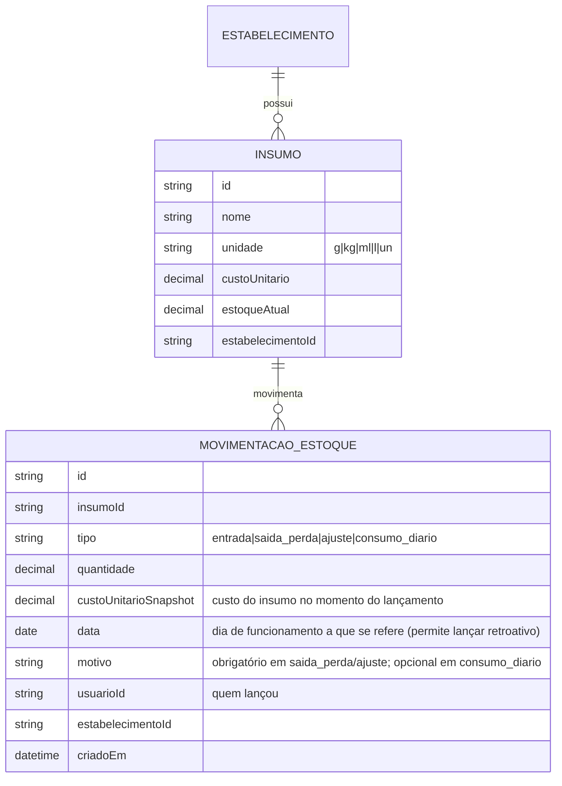

# Estoque Avançado (Fase 4a — Fundação) — Design

Data: 2026-07-08
Status: aprovado para virar plano de implementação (Fase 4a do roadmap de módulos)

## Contexto

O produto hoje só tem `ItemCardapio.estoque` (`Int?`, contador simples de unidades — "avisa quando
acabar"). Isso não responde a pergunta que o dono já faz na prática: **quanto sobrou de lucro real
hoje**, depois de descontar o custo dos insumos usados no dia. O design original do Módulo de Mesas
(`docs/superpowers/specs/2026-07-04-modulo-mesas-design.md`, seção "Estoque / CMV — preparado, não
construído") já antecipava esse módulo como aditivo, com o flag `estoque_avancado` em
`Estabelecimento.modulosAtivos` — que já está na lista `MODULOS_VALIDOS` (`src/routes/admin.ts`) desde
a Fase 1a, sem uso até agora.

Este documento é o resultado de uma sessão de brainstorming que passou por três desenhos diferentes
antes de fechar o escopo final:

1. **Ficha técnica automática por prato** (receita cadastrada por item do cardápio, baixa automática a
   cada venda) — descartada. O modelo quebrava num caso real levantado durante o brainstorming: um
   Baião de Dois é cozido em quantidade — depois de pronto, não tem como "descozinhar" de volta pro
   insumo cru se o cliente cancelar em seguida (diferente de, por exemplo, uma Coca-Cola 2L lacrada,
   que pode voltar ao estoque sem problema). Resolver isso exigiria uma flag de reversibilidade por
   item, mais toda a complexidade de sub-receita/produção em lote que foi levantada em paralelo —
   overhead grande para o ganho de ter CMV por prato individual.
2. **Os dois modelos juntos** (ficha técnica + lançamento manual diário) — descartado por risco de
   contar o custo do mesmo insumo duas vezes (uma pela baixa automática da venda, outra pelo
   lançamento manual do dia), sem um jeito simples de reconciliar os dois.
3. **Só lançamento manual diário** — **decisão final**. Sem ficha técnica, sem sub-receita, sem baixa
   automática vinculada a venda individual, sem lógica de estorno por cancelamento. O dono informa, ao
   final do dia, quanto usou de cada insumo no total — o sistema cruza isso com o faturamento
   confirmado do dia e calcula o lucro real. Reflete como o dono já pensa o negócio na prática, sem
   exigir cadastrar receita precisa de cada prato.

## Decisões do brainstorming (finais)

| Decisão | Escolha |
|---|---|
| Modelo de custo | Lançamento manual diário agregado — **não** ficha técnica por prato |
| Granularidade | Por dia de funcionamento, não por venda/prato individual |
| Unidade de medida do Insumo | Enum fixo (`g`, `kg`, `ml`, `l`, `un`) — evita inconsistência tipo "kg" vs "Kg" |
| Motivo do ajuste de perda/quebra | Obrigatório |
| Motivo do lançamento de consumo diário | Não obrigatório (é rotina, não anomalia — diferente do ajuste de perda) |
| Escopo do faturamento do dia | Soma `Pedido` (balcão/delivery, qualquer status ≠ `cancelado` — mesma definição que o Dashboard atual já usa) **+** `Pagamento` (mesas, status = `confirmado`) |
| Alerta de estoque mínimo | Fica pra Fase 5 (relatórios), como já estava previsto |

## Modelagem de domínio



### Explicação de cada entidade

- **Insumo** — cadastro simples: nome, unidade, custo unitário (editado manualmente pelo dono, sem
  integração com nota fiscal/compra automatizada nesta fase), estoque atual. `estoqueAtual` nunca é
  editado diretamente — é sempre a soma das `MovimentacaoEstoque` daquele insumo (ledger, nunca só um
  contador solto).
- **MovimentacaoEstoque** — ledger append-only. `tipo`:
  - `entrada` — reposição/compra de insumo (entra no estoque).
  - `saida_perda` — perda/quebra, motivo obrigatório.
  - `ajuste` — correção manual de contagem (ex: inventário físico encontrou uma diferença), motivo
    obrigatório.
  - `consumo_diario` — o lançamento central desta fase: quanto foi usado no dia de funcionamento
    (`data`), informado pelo dono ao fechar o expediente. Não é vinculado a uma venda específica —
    é o total agregado do dia.
  - `custoUnitarioSnapshot` é tirado do `Insumo.custoUnitario` no momento do lançamento, pra manter o
    histórico correto mesmo que o custo do insumo mude depois (um "lucro de março" não pode usar o
    preço de hoje).
  - `data` é um campo de data (sem hora), separado de `criadoEm` (timestamp real do lançamento no
    sistema) — permite ao dono lançar o consumo de ontem, se esquecer de fazer no mesmo dia, sem que
    isso aponte pro dia errado no relatório.

## Cálculo de lucro real do dia

```
faturamento_confirmado(dia) = Σ Pedido.total (status ≠ 'cancelado', criadoEm no dia)
                             + Σ Pagamento.valor (status = 'confirmado', criadoEm no dia)

custo_insumos(dia) = Σ MovimentacaoEstoque.quantidade × custoUnitarioSnapshot
                      (tipo = 'consumo_diario', data = dia)

lucro_real(dia) = faturamento_confirmado(dia) − custo_insumos(dia)
```

`Pedido` usa "qualquer status ≠ `cancelado`" porque é exatamente a definição que o Dashboard atual já
usa pra faturamento (`src/routes/estabelecimentos.ts`, linha ~145) — não inventar um critério novo e
inconsistente com o que já existe. `Pagamento` (mesas) usa `status = 'confirmado'` porque, ao contrário
de `Pedido`, já modela esse status explicitamente (`pendente|confirmado|recusado|estornado`) — é o
sinal mais direto de "isso é dinheiro que de fato entrou". O Dashboard hoje **não** inclui receita de
mesas (só `Pedido`) — esta fase corrige isso especificamente para o relatório de lucro diário, sem
alterar o Dashboard geral (fora de escopo).

## Papéis e permissões

Nova permissão `estoque`, separada de `cardapio` — segue o padrão já estabelecido (1 permissão ≈ 1
tela: `cozinha`→Cozinha, `cardapio`→Cardápio, `mesas`→Mesas, `caixa`→Caixa). Rotas novas exigem
`temPermissao('estoque')` **e** `moduloAtivo('estoque_avancado')` (já na lista `MODULOS_VALIDOS`,
sem uso até agora) — as duas checagens são independentes, mesmo padrão que `mesas` já usa.

Telas novas (nomes provisórios, refinar no plano de implementação):
- `/insumos` — CRUD de Insumo (nome, unidade, custo unitário, estoque atual, entrada/ajuste manual).
- `/estoque/fechamento-dia` (ou nome equivalente) — lançamento do consumo do dia (um ou mais insumos
  de uma vez, todos com a mesma `data`), com o cálculo de lucro do dia exibido logo depois de salvar.
- Um histórico simples (lista de dias já lançados, com faturamento/custo/lucro de cada um) — evita
  precisar entrar em cada dia individualmente pra ver o retrato geral.

## Fora de escopo desta fase

- **Ficha técnica por prato / CMV por item individual** — descartada nesta rodada (ver "Contexto"),
  não só adiada. Se no futuro fizer sentido ter CMV por prato, é um desenho novo a partir do zero, não
  uma continuação desta fase.
- **Sub-receita / insumo composto produzido em lote** — descartada junto com a ficha técnica, pelo
  mesmo motivo.
- **Baixa automática vinculada a venda individual e estorno por cancelamento** — não se aplica a este
  modelo; o consumo é um lançamento agregado do dia, não rastreado por venda.
- **Alerta de estoque mínimo** — fica pra Fase 5 (relatórios), junto com o resto da wishlist já
  documentada no design original do Módulo de Mesas.
- **Editar um lançamento de `consumo_diario` já salvo** — a decidir no plano de implementação; opção
  mais simples é permitir um novo lançamento complementar/corretivo no mesmo dia em vez de editar o
  original (mantém o ledger append-only, consistente com o resto do sistema).

## Riscos

- **Depende inteiramente da disciplina do dono em lançar todo dia.** Sem hooks automáticos, um dia sem
  lançamento de consumo fica com `custo_insumos(dia) = 0` — o "lucro do dia" aparece inflado (não é
  zerado, o problema é o oposto: parece que não houve custo nenhum). Aceitável como troca consciente
  pela simplicidade, mas vale considerar um lembrete visual (ex: badge "consumo de hoje ainda não
  lançado") no plano de implementação.
- **Faturamento cruza duas fontes com semânticas de "confirmado" diferentes** (`Pedido`: qualquer
  status ≠ cancelado; `Pagamento`: status explicitamente confirmado) — documentado aqui de propósito
  para não ser confundido depois como inconsistência não intencional.
- **Sem granularidade por prato.** Se dois pratos usam o mesmo insumo em proporções muito diferentes,
  o relatório não distingue qual prato consumiu mais — é uma limitação aceita, não um bug.

## Fases de implementação propostas

1. **Fase 4a — Fundação** *(escopo deste documento — próximo passo é o plano de implementação)*:
   schema (`Insumo`, `MovimentacaoEstoque`), permissão `estoque`, tela de cadastro de insumo, tela de
   lançamento diário de consumo, cálculo e exibição de lucro real do dia.
